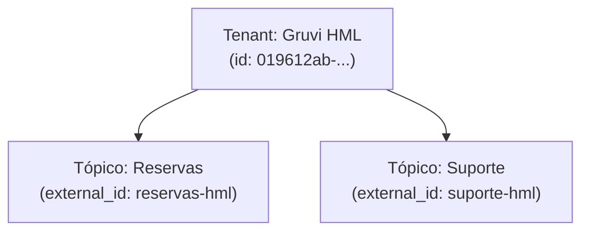

# **PR with Diagrams — PR com Diagrama Mermaid de Dados Reais**

Use esta skill quando precisar gerar uma descrição de PR que inclua um diagrama Mermaid representando entidades, fluxos ou relações que existem no banco de dados local.

**Regra absoluta:** nenhum ID, external_id, nome de tenant, slug ou valor de banco pode ser inventado ou usado como placeholder. Todos os valores devem ser obtidos via query antes de gerar o diagrama.

---

## Fluxo obrigatório

### Etapa 1 — Entender o escopo da PR

Antes de qualquer query ou diagrama, leia o diff da branch atual:

```bash
git diff main...HEAD --stat
git diff main...HEAD
```

Identifique:
- Quais entidades foram criadas, alteradas ou removidas
- Quais tabelas do banco são afetadas
- Qual fluxo de negócio o diagrama deve ilustrar

---

### Etapa 2 — Buscar dados reais no banco

> **Use a skill `query-local`**

Para cada entidade relevante ao diagrama, execute queries para obter valores reais. Exemplos:

```sql
-- IDs e nomes de tenants envolvidos
SELECT id, name, external_id FROM tenants ORDER BY created_at DESC LIMIT 5;

-- Tópicos associados
SELECT id, name, external_id, tenant_id FROM topics WHERE tenant_id = '<<ID_DO_TENANT>>';

-- Protocolos ou jornadas recentes
SELECT id, external_id, status FROM journeys ORDER BY created_at DESC LIMIT 5;
```

**Nunca pule esta etapa.** Se o banco estiver inacessível, informe o usuário e pare aqui — não gere o diagrama com dados fictícios.

---

### Etapa 3 — Gerar o diagrama Mermaid com dados reais

Com os valores obtidos na Etapa 2, monte o diagrama usando apenas dados reais. Escolha o tipo de diagrama mais adequado ao fluxo:

- **flowchart TD** — para fluxos de processo ou decisão
- **erDiagram** — para relações entre entidades
- **sequenceDiagram** — para interações entre serviços/agentes

Exemplo com dados reais:

````markdown

````

---

### Etapa 4 — Gerar a descrição da PR

Use o template em `.github/pull_request_template.md` como base. Preencha cada seção com informações do diff e dos dados reais obtidos:

- **Objetivo:** o que a PR resolve (extraído do diff)
- **O que mudou:** lista das alterações técnicas (extraída do diff)
- **Diagrama:** cole o Mermaid gerado na Etapa 3 dentro da seção de Evidências
- **Como validar:** passos concretos usando os IDs reais obtidos no banco

Escreva o resultado no arquivo `pull_request.md` na raiz do projeto:

```bash
> pull_request.md  # limpa o arquivo antes de escrever
```

---

### Etapa 5 — Revisar antes de entregar

Verifique:

- [ ] Nenhum valor no diagrama é placeholder (`<<ID>>`, `uuid-aqui`, `example`, etc.)
- [ ] Os IDs no diagrama batem com os obtidos via query na Etapa 2
- [ ] A descrição cobre todas as mudanças relevantes do diff
- [ ] O arquivo `pull_request.md` foi criado/atualizado

---

## Regras rápidas

- Se o banco estiver inacessível, **não gere o diagrama** — avise o usuário.
- Nunca invente `external_id`, `tenant_id` ou qualquer FK — consulte sempre.
- O diagrama vai para a seção `📸 Evidências` do template de PR.
- Se o diagrama ficar muito grande, prefira um `erDiagram` focado nas entidades alteradas pela PR, não em todo o schema.
